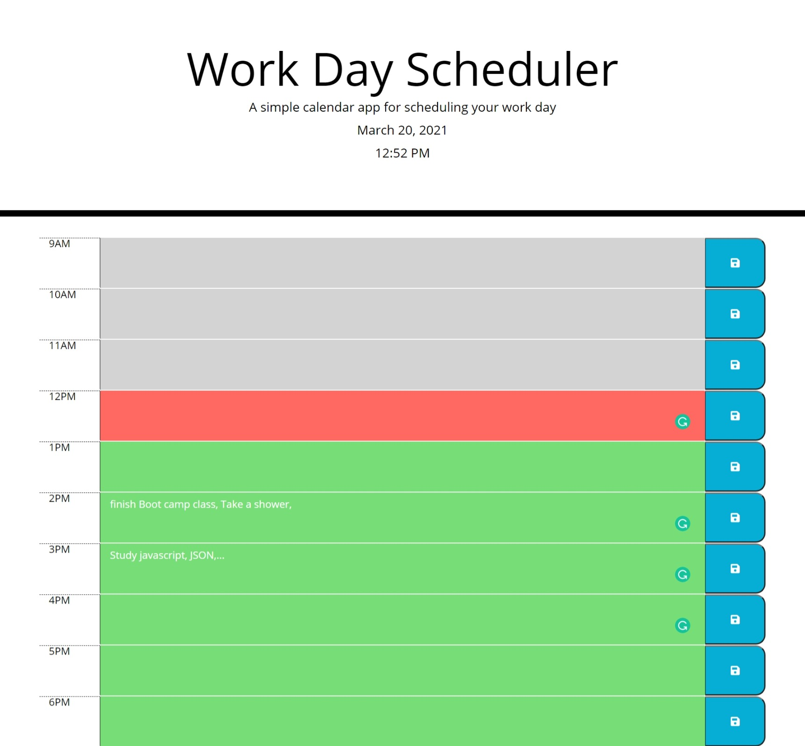

# 05 Third-Party APIs: Work Day Scheduler

## User Story

```md
AS AN employee with a busy schedule
I WANT to add important events to a daily planner
SO THAT I can manage my time effectively
```


The following animation demonstrates the application functionality:




### Deployment: 

* Application deployed at live URL.

[Click here to go to deployed application.](https://behnoosh93.github.io/dayScheduler/)

* Application GitHub URL submitted.

[Click here to go to deployed application.](https://github.com/Behnoosh93/dayScheduler)


